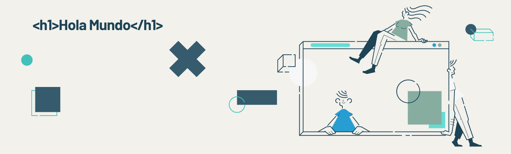

<h1 align="center">Hola 👋, soy Borja Riveiro</h1>
<h3 align="center">FrontEnd Developer</h3>

<a href="https://drive.google.com/file/d/1864k5-_OBtEZQkqouClkoEiOHMCjXOes/view?usp=sharing" target="_blank">Ver curriculum</a>
 
<a href="https://drive.google.com/uc?id=1864k5-_OBtEZQkqouClkoEiOHMCjXOes&export=download">Descargar Curriculum</a>

<h3 align="left">Tecnologias:</h3>
<table align="center">
  <tbody>
    <tr height="150">
      <td  width="300" align="center">
          
      </td>
      <td width="300" align="center">
        
      </td>
      <td width="300" align="center">
        
      </td>
    </tr>
    <tr height="150">
      <td width="300" align="center">
        
      </td>
      <td width="300" align="center">
        
      </td>
      <td width="300" align="center">
        
      </td>
    </tr>
    <tr height="150">
      <td width="300" align="center">
        
      </td>
      <td width="300" align="center">
        
      </td>
      <td width="300" align="center">
        
      </td>
    </tr>
  </tbody>
</table>

<h3 align="left">Herramientas:</h3>

<table align="center">
  <tbody>
    <tr height="150">
      <td  width="300" align="center">
          
      </td>
      <td  width="300" align="center">
          
      </td>
      <td  width="300" align="center">
          
      </td>
      <td  width="300" align="center">
          
      </td>
    </tr>
  </tbody>
</table>

<h3 align="left">Contacta conmigo:</h3>

  <a href="https://linkedin.com/in/borjariveiro" target="_blank"
    >linkedin.com/in/borjariveiro/</a>
  

    borja.riveiro@hotmail.com
  

